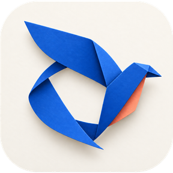

<p align="center">
  
</p>

<h1 align="center">Osuna</h1>

<p align="center">
  <a href="README.md">English</a> ·
  <a href="README.zh-CN.md">简体中文</a> ·
  <a href="README.ja.md">日本語</a> ·
  <a href="README.ko.md">한국어</a>
</p>

<p align="center">
  <a href="https://github.com/LFT-OXY/Osuna/releases">
    
  </a>
</p>

<p align="center">Claude Code, Codex, Copilot, OpenCode, Pi 에이전트를 위한 하나의 인터페이스</p>

내 컴퓨터에서 에이전트를 병렬로 실행하세요. 데스크톱이나 휴대폰에서 배포하세요.

- **셀프 호스팅:** 에이전트는 완전한 개발 환경이 갖춰진 내 컴퓨터에서 실행됩니다. 평소 쓰던 도구, 설정, 스킬을 그대로 쓸 수 있습니다.
- **여러 제공자 지원:** Claude Code, Codex, Copilot, OpenCode, Pi를 하나의 인터페이스에서 사용할 수 있습니다. 작업마다 알맞은 모델을 고를 수 있습니다.
- **음성 제어:** 음성 모드에서 작업을 말로 지시하거나 문제를 음성으로 함께 검토할 수 있습니다. 손을 쓰지 않고 작업해야 할 때 유용합니다.
- **여러 기기 지원:** 데스크톱, 웹, CLI, 휴대폰을 지원합니다. 데스크톱에서 시작해 휴대폰으로 확인하고 터미널에서 자동화할 수 있습니다.
- **개인정보 보호 우선:** Osuna는 텔레메트리, 추적, 강제 로그인을 사용하지 않습니다.

> [!NOTE]
> Osuna는 [Paseo](https://github.com/getpaseo/paseo)의 포크입니다. 내부 식별자는 업스트림 표기를 그대로 씁니다. CLI 명령은 여전히 `paseo`이고, 데이터는 `~/.paseo`에 있으며, 환경 변수는 `PASEO_`로 시작합니다.

## 플러그인

신뢰할 수 있는 TypeScript 플러그인으로 테마, 워크스페이스 패널, 명령, 설정 화면, 코딩 에이전트 제공자를 추가할 수 있습니다.
`paseo plugin add <source>`로 로컬 디렉터리나 Git 저장소에서 설치하세요.

자세한 내용은 [플러그인 문서](docs/plugins.md)를 참고하세요. 플러그인은 데몬이 실행되는 머신에 접근할 수 있고, 연결된 클라이언트 안에서도 실행됩니다. 신뢰할 수 있는 코드만 설치하세요.

## 시작하기

Osuna는 코딩 에이전트를 관리하는 로컬 서버인 데몬을 실행합니다. 데스크톱 앱, 웹 앱, CLI, Paseo 모바일 앱 같은 클라이언트가 이 데몬에 연결합니다.

### 준비 사항

아래 에이전트 CLI 중 하나 이상을 설치하고 인증 정보를 설정해야 합니다.

- [Claude Code](https://docs.anthropic.com/en/docs/claude-code)
- [Codex](https://github.com/openai/codex)
- [GitHub Copilot](https://github.com/features/copilot/cli/)
- [OpenCode](https://github.com/anomalyco/opencode)
- [Pi](https://pi.dev)

### 데스크톱 앱(권장)

[GitHub 릴리스 페이지](https://github.com/LFT-OXY/Osuna/releases)에서 다운로드하세요. 앱을 열면 데몬이 자동으로 시작됩니다. 별도로 설치할 것은 없습니다.

휴대폰에서 연결하려면 공식 Paseo 모바일 앱을 설치한 뒤, Osuna에서 **Settings → 호스트 → Pair Device**를 여세요.

### CLI

데스크톱 앱에서 **Settings → Integrations → Command line**을 열고 **Install**을 클릭하세요. `paseo` 명령이 `~/.local/bin`에 링크됩니다.

npm에서 `@getpaseo/cli`를 설치하지 마세요. 그 패키지는 업스트림 Paseo이며 Osuna가 아닙니다.

### Docker

Docker에서 Osuna 데몬과 셀프 호스팅 웹 UI를 실행하세요. 이 방식은 서버나 원격 머신에서 유용합니다.

```bash
docker run -d --name osuna \
  -p 6767:6767 \
  -e PASEO_PASSWORD=change-me \
  -v "$PWD/paseo-home:/home/paseo" \
  -v "$PWD:/workspace" \
  ghcr.io/lft-oxy/paseo:latest
```

컨테이너가 시작되면 `http://localhost:6767`을 여세요. 사용하는 에이전트 CLI를 기본 이미지에 추가한 뒤, 환경 변수나 영구 `/home/paseo` 볼륨으로 인증 정보를 설정하세요. 자세한 내용은 [Docker 문서](docs/docker.md)를 참고하세요.

## CLI 사용법

앱에서 할 수 있는 모든 작업은 터미널에서도 할 수 있습니다.

```bash
paseo run --provider claude/opus-4.6 "implement user authentication"
paseo run --provider codex/gpt-5.5 --worktree feature-x "implement feature X"

paseo ls                           # 실행 중인 에이전트 목록
paseo attach abc123                # 실시간 출력 스트리밍
paseo send abc123 "also add tests" # 후속 작업 전송

# 원격 데몬에서 실행. --cwd는 그 호스트의 경로입니다
paseo run --host workstation.local:6767 --cwd /workspace "run the full test suite"
```

전체 명령 목록은 `paseo --help`로 확인하세요.

## 스킬

스킬은 에이전트가 Osuna를 통해 다른 에이전트를 오케스트레이션하는 방법을 알려 줍니다.

```bash
npx skills add LFT-OXY/Osuna
```

그런 다음 어떤 에이전트 대화에서든 아래 명령을 사용할 수 있습니다.

- `/paseo-handoff` — 에이전트 간에 작업을 넘깁니다. Claude로 계획을 세운 뒤 Codex에 구현을 넘길 때 이 기능을 씁니다.
- `/paseo-advisor` — 작업 자체를 넘기지 않고, 에이전트 하나를 조언자로 띄워 두 번째 의견을 받습니다.
- `/paseo-committee` — 서로 다른 관점의 에이전트 두 개로 위원회를 구성해, 한 발 물러나 근본 원인을 분석하고 계획을 세웁니다.

## 개발

모노레포 패키지 구성은 다음과 같습니다.

- `packages/server`: Osuna 데몬(에이전트 프로세스 오케스트레이션, WebSocket API, MCP 서버 제공)
- `packages/app`: Expo 클라이언트(iOS, Android, 웹)
- `packages/cli`: `paseo` CLI(데몬과 에이전트 워크플로)
- `packages/desktop`: Electron 데스크톱 앱
- `packages/relay`: 데몬과 클라이언트가 쓰는 릴레이 전송 및 암호화 패키지
- `packages/website`: 업스트림 마케팅 사이트 및 문서(`paseo.sh`). 이 포크에서는 배포하지 않습니다

자주 쓰는 명령:

```bash
# 모든 로컬 개발 서비스 실행
npm run dev

# 개별 환경 실행
npm run dev:server
npm run dev:app
npm run dev:desktop
npm run dev:website

# 서버 스택 빌드
npm run build:server

# 레포 전체 검사 실행
npm run typecheck
```

전체 개발 환경 설정은 [docs/development.md](docs/development.md)를 참고하세요.

## 라이선스

Apache-2.0
